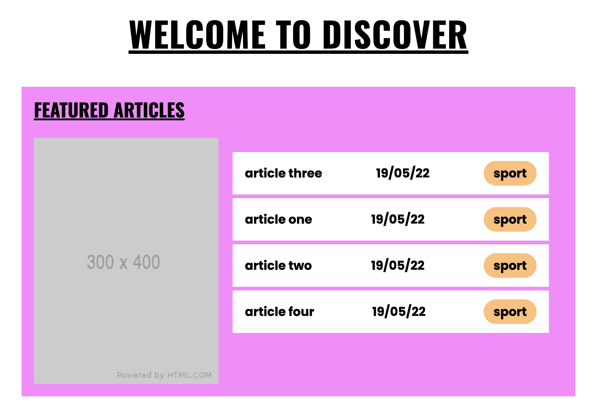
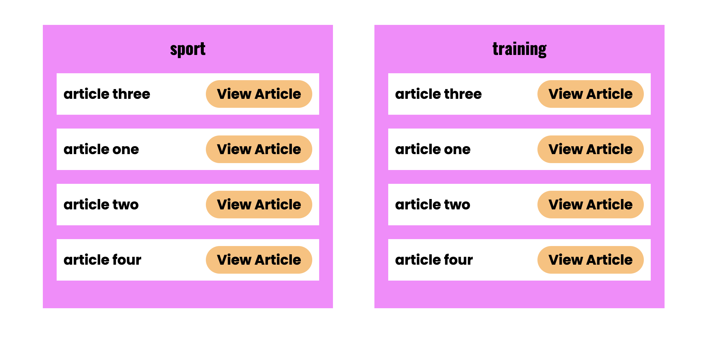
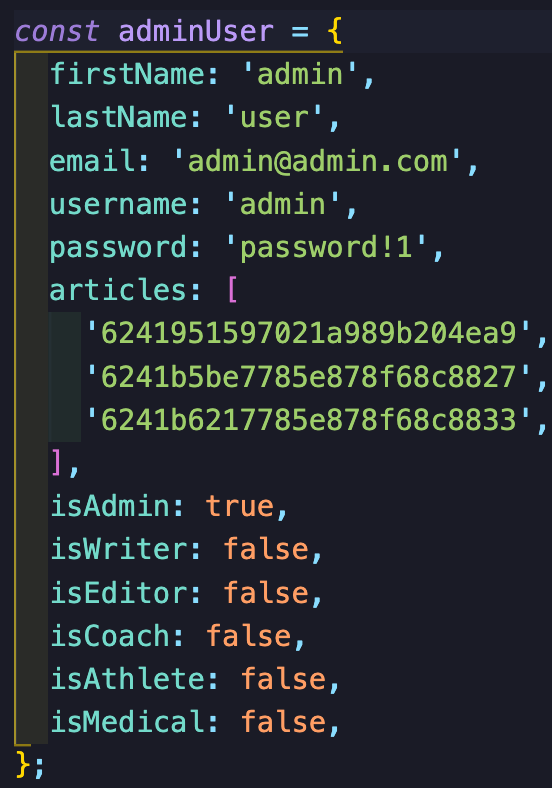
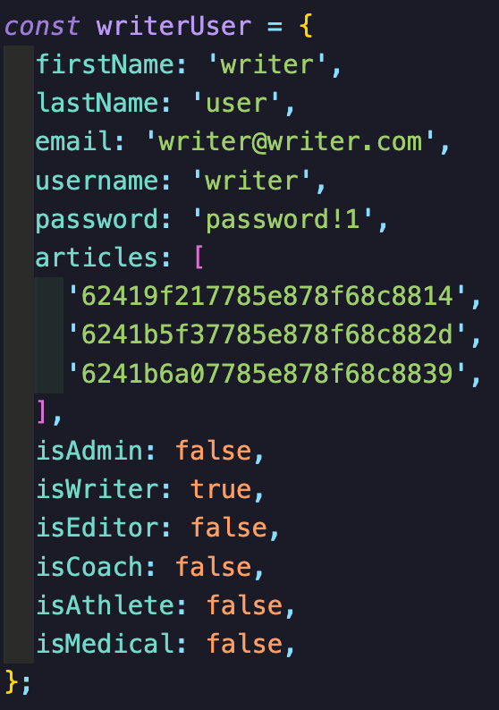
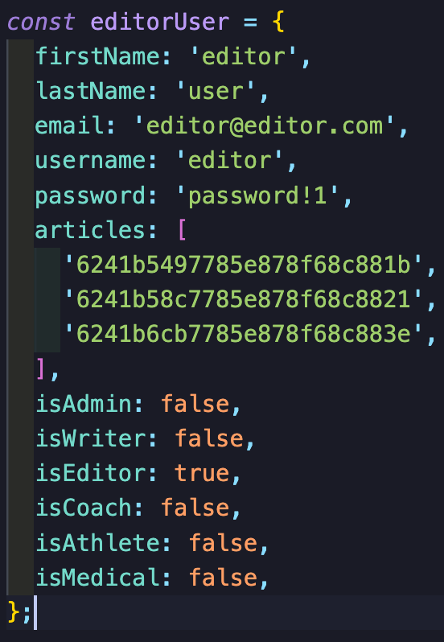

# Accelerate Inc - SEI Project 3 - Group project

## Timeframe

8 days

Link to deployed app: [Accelerate Inc]('https://tinyurl.com/24pkdjpu')

## Overview

Accelerate Inc is a Full-Stack MERN application with CRUD functionality. The project was created over a one week period in a group of three (with Karim Ali and Marco Manunta). Accelerate Inc is designed to be a multi-function application aimed at administrators for managing athlete applications, medical reporting, sessions, attendance, and article publication in a dedicated blogging system right out of the box.

## The Brief

- Build a full-stack application by making your own backend and your own front-end.
- Use an Express API to serve your data from a Mongo database.
- Consume your API with a separate front-end built with React.
- Be a complete product which most likely means multiple relationships and CRUD functionality for at least a couple of models.
- Implement thoughtful user stories/wireframes that are significant enough to help you know which features are core MVP and which you can cut.
- Be deployed online so it’s publicly accessible.

## Technologies used

### Backend

- Node.js
- MongoDB
- Mongoose
- Express
- Nodemon
- Bcrypt
- JSON Web Token

### Frontend

- React
- CSS
- Axios
- React-Router-Dom

### Development Tools

- Adobe XD (wireframing)
- Postman
- Git & GitHub
- Netlify (frontend deployment)
- Heroku (database deployment)
- VS Code

# Planning

## Day 1 - Production planning

On the first day we scheduled a Zoom call to present what ideas we had in mind for our project. After a brief discussion we decided on developing a project based on an idea that Karim had. The concept was to create an app that manages athlete applications, medical reporting, sessions, attendance, and article publication in a dedicated blogging system, and took inspiration from an amputee cycling team that he manages. While the initial concept was large in scope and complexity, we ensured that we worked together to prioritise the features of the product based on importance and possibility given the time that was allocated to us for this project.

We ended up deciding on prioritising the following features:

- Article Publication and Management System
- Site User Management System with multiple user permission tiers
- Athlete Applications Management System
- Athletes Medical Complications Management System
- Training Sessions Management System
- Athlete Attendance Management System
- CSS Styling for mobile optimization

We then split our responsibilities by assigning each a feature to develop, both the backend and the frontend.

I was responsible for seeding the user data we have from our database to be populated to the frontend. The data establishes what level of access the user would have to the app depending on their role. And the handling of user password hashing through jwt encryption for login.

## Day 2 - Design & Planning

The wireframing was done on Adobe XD, which enabled us to visualise the production timeline for each of the 7 features identified above, including a home page. To streamline our workload, components were then simplified, allowing us to identify primary components to create and use across the site.

Some examples:

Using Airtable, we established tasks for each team member in order to manage the construction of components, user journeys and APIs. The build process was split into:

- API Dev.
- Front End Template components.
- Front end Build for each feature.

## Day 3 & 4 - Backend development

The application was divided into client and server-side. To start, we began by creating the back end using MongoDB, where each member developed different models and controllers. The links were then tested on Postman, once we were satisfied with how our data was being called, we then moved onto building our frontend.

## Day 5 - Frontend compnonet development

We started by creating template code samples for getting and pushing data. We also created controllers to manipulate that data. We created a form, card and table templates dividing the work equally across the team members.

## Day 6 - Frontend build

Once the frontend components were developed, we then divided the user journeys between Marco, Karim, and I in order to avoid clashing during production, this was achieved by creating individual git branches to work on. Once we finished our feature branches, we would then merge with the main branch and move onto the next task.

## Day 7 - Styling

Styling was made by creating custom variables which sped up the process as we would only need to call classes on our feature branch.

## Day 8 - Debugging and Optimization

We spent most of the day debugging any errors on both the frontend and backend, and also adding little touches to our features.

# Featured code

Seeding the database took longer than I anticipated, stretching well over 2 days. The nature of our database meant we have many users each with different levels of access to the app. This meant I couldn’t write a ‘catch-all’ piece of code that could populate the front-end. All in all, the code is very solid, and I’m happy with my work here.

## Wins

Creating many relationships between models in the backend was a big win as it allowed features like situational filtering depending on user role, and what level of access the user might have. For example, a medical user would have access to athletes data, admin would have all access.

## Challenges

To make the complex relationships work was a big challenge, and took far longer than we anticipated, especially as we were only using MongoDB for the first time. This made it difficult at times when trying to get the frontend and backend to work harmoniously. However, the ability to simply use JavaScript in manipulating the back-end helped smoothen some of the issues.

## Bugs

Sometimes the Mongoose filtering functions wouldn’t work as expected, so we’d have to implement filtering on the frontend.

## Future Improvements

Implementing a full responsive design and image upload for articles and athletes.

## Key learnings

Working in a group of three was a great way to learn about how to best communicate, plan and delegate responsibilities. Funnily enough, working on such a relationship heavy project with MongoDB well prepared us for future endeavours with Django/Postgres-based projects.
